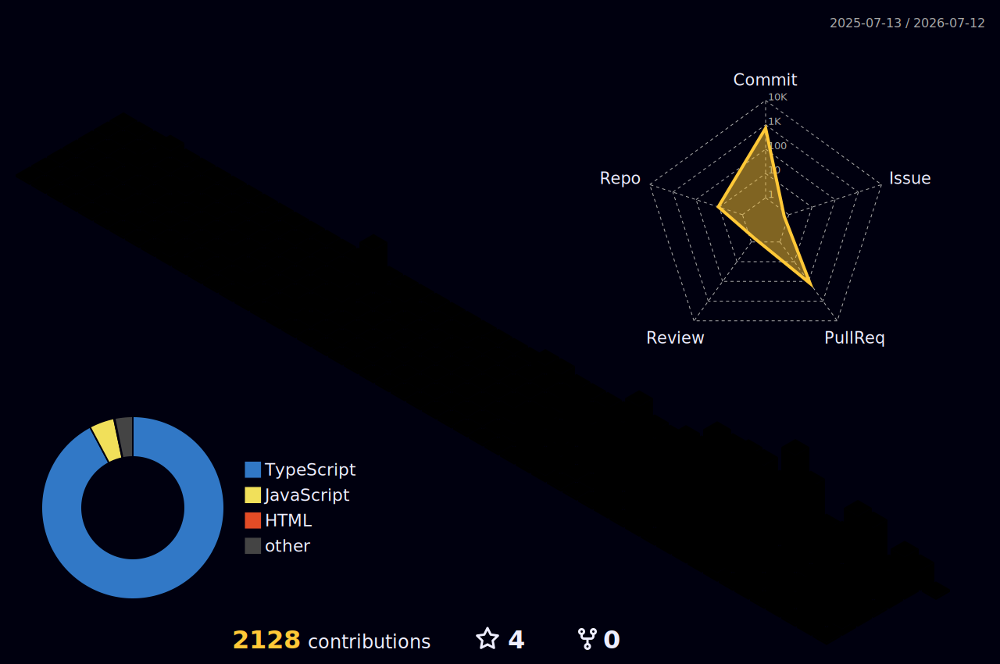

<!-- RED ACCENT LINE -->

 

<!-- NAME - clean, no marquee spam -->
<picture>
  
</picture>

 
—   F U L L - S T A C K   E N G I N E E R   ·   A I / M L    — 

  

<!-- SOCIAL BADGES -->

 

<!-- STATS GRID -->

 

---

<!-- 3D CONTRIBUTION GRAPH -->

  

 

